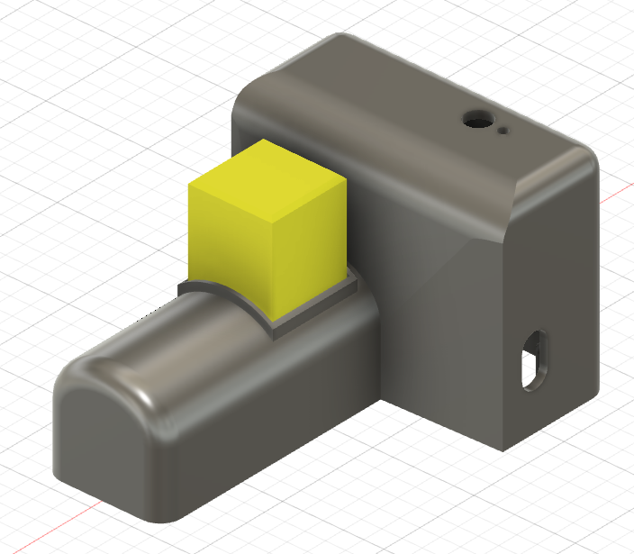
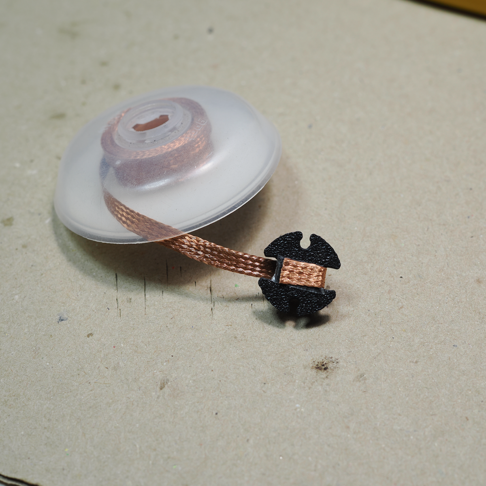
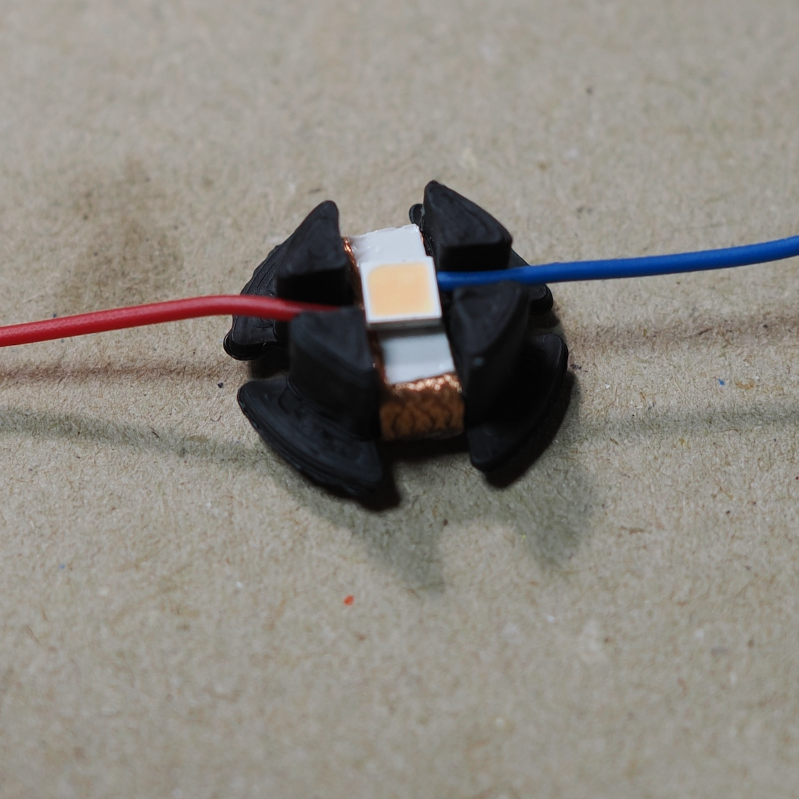
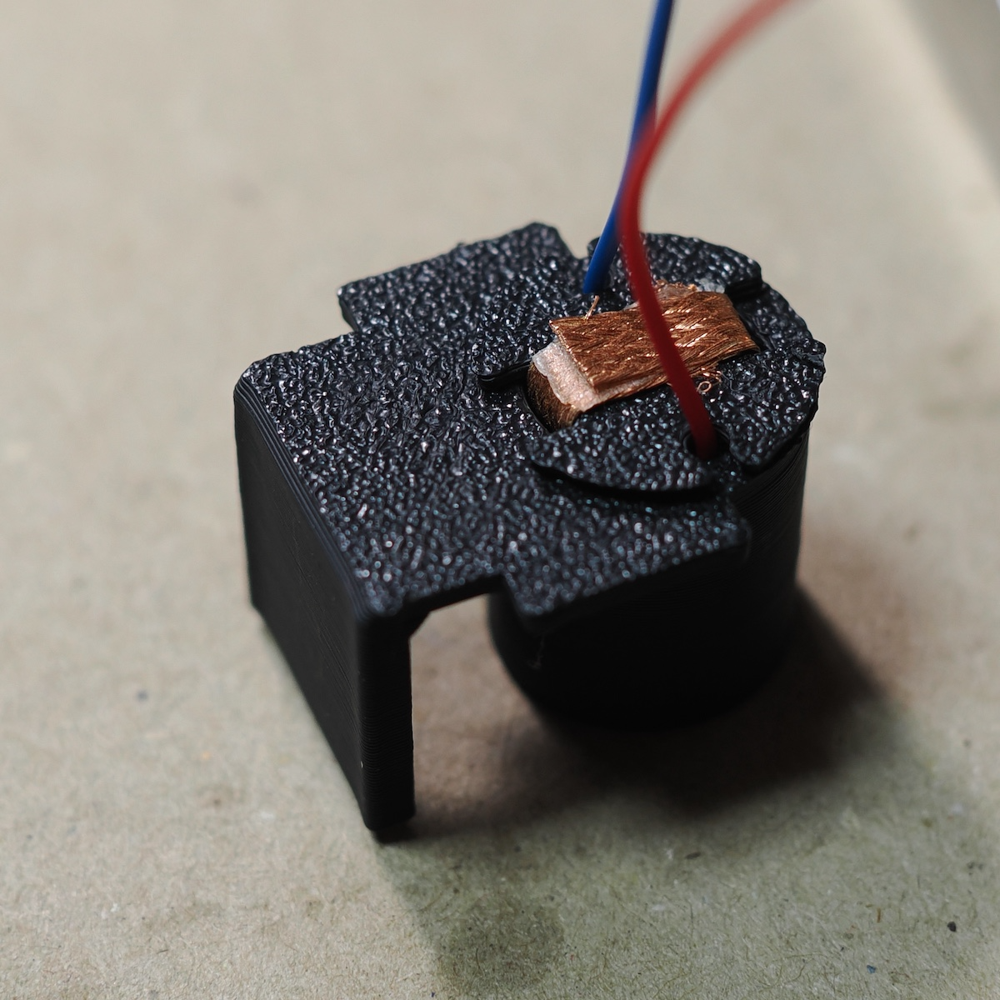
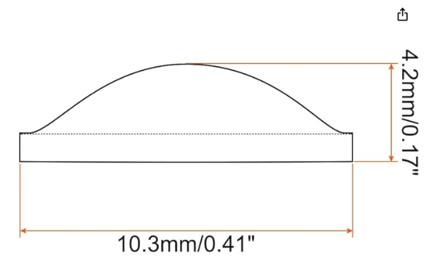
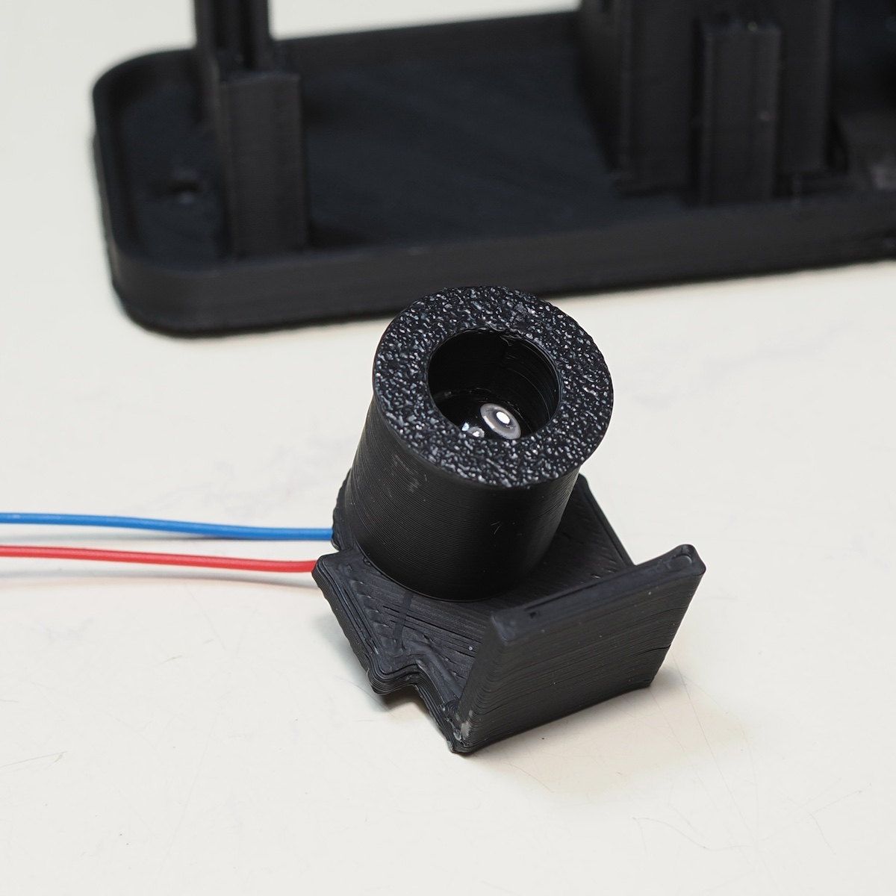

# EduSpectroStation
筐体・光学系設計データ
[📖 総合ガイド（Webサイト）はこちら](https://eduspectro.github.io/)

EduSpectroStationは手軽に分光透過率や分光光度が測定できるように投光器、キュベット、センサーをキュベット底面から15mmの高さで直線的に配置した測定装置です。

### 1. 3Dプリント以外に必要な部品
 
EduSpectro4X基板、投光器のLEDをON-OFFするトグルスイッチ、投光器用レンズ、白色LED、キュベットなどが必要です。

---
### 2. 3Dプリント用モデルファイル（STL）
 
3Dプリント用モデルファイルはSTLフォルダに入っています。

**推奨素材** : 遮光性を高めるために、黒色マットのPLAがおすすめです。
**プリント設定**: サポート有で出力

GitHubには「STL表示機能」がありますので、パーツを3D表示で見てみましょう。

 
**本体**　 
 

 
 

[ベースプレート](stl/BasePlate.stl):EduSpectroStationの土台です。 
[キュベットホルダー](stl/CuvetteHolder.stl):キュベットを入れる枠です。光路周辺だけ光が通ります。 
[サポート](stl/Support.stl):光路にセンサーを置くための基板の位置ぎめサポートです。 
 

**投光器**　 
 

 
 

[投光器筐体](stl/Light.stl):投光器の土台です。 
[LEDブロック](stl/BaseLED.stl):LEDを保持します。外そうと思えば外れるけれど自然には外れないハメ合いで造形します。 
[ピンホール](stl/Hole.stl):ピンホールをLED側にして置きます。ピンホールの面から側面の端部までの距離は使用したレンズの焦点に合わせて4mmにしました。レンズの焦点距離に合わせて調整します。 
[レンズ押さえ](stl/Ring.stl):レンズを置いてからはめ込みます。外そうと思えば外れるけれど自然には外れないハメ合いで造形します。 

 
 

**遮光カバー**　 
 
 

[本体カバー](Cover.stl):装置の遮光カバーです。 
[キュベット部カバー](stl/CapCuvette.stl):キュベットの開口用遮光カバーです。 

**その他**　 
[絶縁フィルム](FilmSNR.stl):分光センサーとICソケットのショートを防止するフィルムです。 

**3Dプリントが不要な3Dモデル**　 
[基板](SensorBD.stl):装置の遮光カバーです。 
[キュベット](stl/Cuvette.stl):キュベットの開口用遮光カバーです。 

 
 

---
### 3. 「LED投光器」の作成
 

**LEDの準備**: 3mm角のLEDを使用します。AWG28の耐熱電子ワイヤーをLEDの端子にハンダ付けします。 
**手作りヒートシンク**: LEDブロックにヒートシンクとして3mm幅のハンダ吸い取り線を1周回して両面テープで接着します。 
**熱伝導テープでヒートシンクに貼り付け**: ヒートシンクに熱伝導テープ（両面テープ）をつけ、LEDを貼ります。 
 
 
 
 
 
**レンズ**: レンズは「アクリル 平凸レンズ 10mm」で検索して探しました。 
 
 

 
 
 

---
### 4. 「遮光スポンジ」の作成
横からの光をブロックするために1mm厚のスポンジをセンサーの窓の周りに貼り付けます。
 
 
 
 

---

