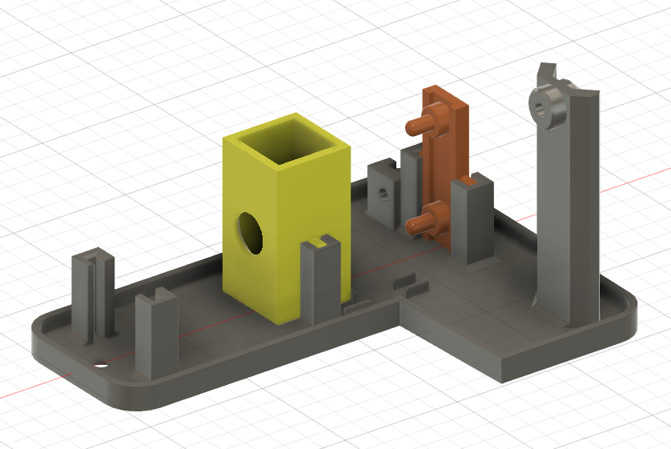
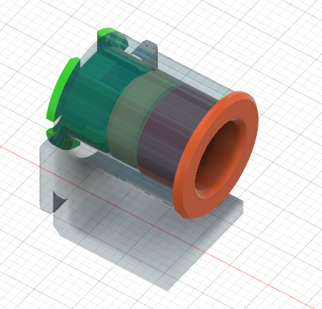

# EduSpectroStation
筐体・光学系設計データ
[📖 総合ガイド（Webサイト）はこちら](https://eduspectro.github.io/)

### 1. GitHubには「STL表示機能」がありますので、パーツを3D表示で見てみましょう。
 

 
 

[ベースプレート](stl/BasePlate.stl):EduSpectroStationの土台です。 
[キュベットホルダー](stl/CuvetteHolder.stl):キュベットを入れる枠です。光路周辺だけ光が通ります。 
[サポート](stl/Support.stl):光路にセンサーを置くための基板の位置ぎめサポートです。 
 

 
 

[投光器筐体](stl/Light.stl):投光器の土台です。 
[LEDブロック](stl/BaseLED.stl):LEDを保持します。 
[ピンホール](stl/Hole.stl):ピンホールをLED側にして置きます。 
[レンズ押さえ](stl/Ring.stl):レンズを置いてからはめ込みます。 

 
 

3Dプリンタ

*   **推奨素材**: 「遮光性を高めるために、黒色マットのPLAがおすすめです」
*   **プリント設定**: 
    *   サポートの有で出力するのがお勧め

---

### 3. 「LED投光器」組み立て説明の書き方

光源部分は光学系において非常に重要な部分です。READMEには以下のように書くと分かりやすくなります。

#### 記述イメージ：
> ### 💡 LED投光器の組み立て
> 1. **LEDの準備**: 高演色白色LEDのプラスとマイナスを確認します。
> 2. **配線**: RP2350からの電源供給ラインに、適切な抵抗を挟んで接続します。
> 3. **固定**: `stl/led_housing.stl` にLEDを差し込み、光がキュベットの中心を向くように調整します。
> 
>   *(※ここに写真や図解を貼る)*

---

### 4. 部品リスト (BOM) の作成

3Dプリントできない「市販部品」をリスト化しておくと、導入のハードルが下がります。

*   **光学部品**: 回折格子（シート）、スリット
*   **電気部品**: LED、抵抗器、ジャンパワイヤ
*   **固定部品**: M3ネジ、ナットなど

---

### 5. GitHubの「STL表示機能」の活用

実はGitHubには、**STLファイルをブラウザ上で3D表示する機能**が標準で備わっています。

*   リポジトリにアップロードした `.stl` ファイルをGitHub上でクリックすると、マウスでくるくる回して形状を確認できます。
*   これがあるおかげで、ユーザーは「どのパーツがどれか」を印刷前に確認できるので、非常に便利です。

-
